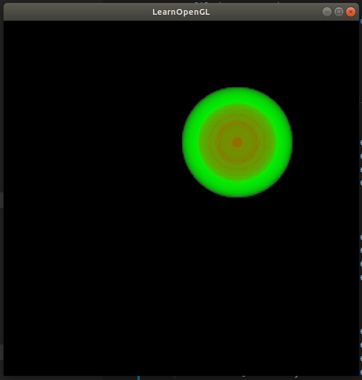

# ray casting to draw a sphere

## introduction  
using opengl glsl to write vertex shader and fragment shader to using gpu to speed up
生成的体数据：2.py生成voxel.txt体数据，球体​rgba为255,0,0,255，其他空间rgba为0,0,0,0​​
raycasting代码：外围绿色球rgba 0,255,0,128，内部红色球255,0,0,254，opengl编写，结果看result.png
## how to use  
```
cd build
cmake ../
make
./raycast
```

